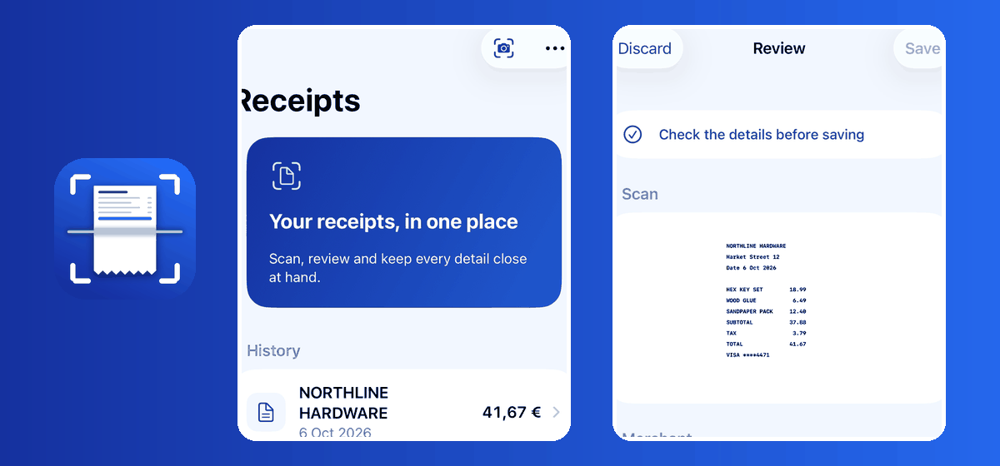
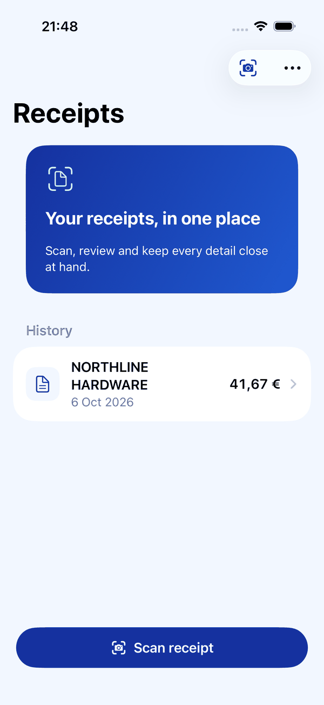
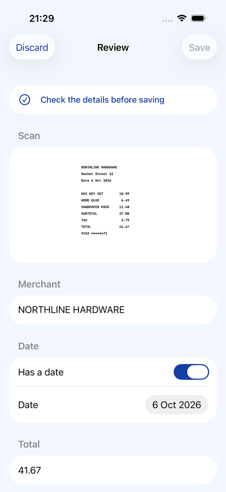
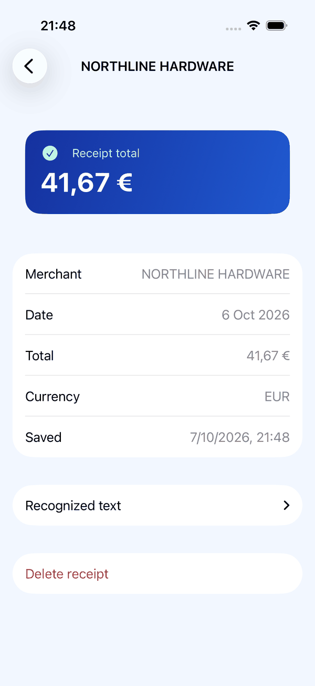
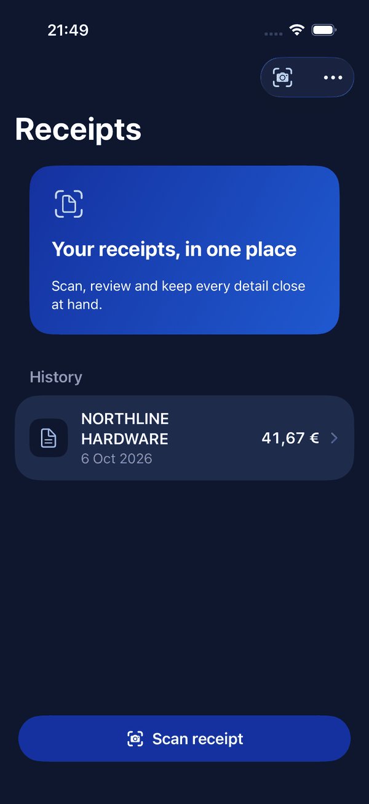
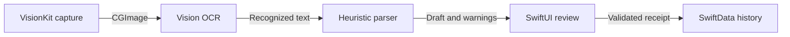

# Receipt Scanner

**Turn paper receipts into editable records, entirely on your iPhone.**

  

[Try it](#try-it) · [Screenshots](#screenshots) · [Architecture](#architecture) · [Documentation](#documentation)

Receipt Scanner uses VisionKit and on-device Vision OCR to extract a merchant, date, total and currency. You review uncertain fields before anything is saved to a local SwiftData history. There is no public demo or App Store build yet.

## What it includes

- **Scan and recognize:** capture a receipt with VisionKit; text recognition runs on the device.
- **Review before saving:** correct any field, see a scan thumbnail, and leave ambiguous values unset instead of guessing.
- **Local history:** open, relaunch and delete saved receipts; scanned images are not retained.
- **Offline workflow:** OCR, parsing and persistence require no external service.
- **Reproducible demo:** a Debug-only sample receipt runs through real OCR on the simulator.

## Try it

Requires Xcode with an iPhone simulator. Build with one command, then open ReceiptScanner.xcodeproj and run the ReceiptScanner scheme. In a Debug build, use More → Try sample receipt; a physical iPhone is needed for the camera.

    xcodebuild -project ReceiptScanner.xcodeproj -scheme ReceiptScanner -destination 'platform=iOS Simulator,name=iPhone 17 Pro' build

## Screenshots

The cover pairs the real app icon with crops of the screens below. Captured on an iPhone 17 Pro simulator with the sample receipt. The UI test and [demo walkthrough](docs/demo.md) describe the same flow; these PNGs are committed so the README renders on GitHub. Select an image to view it at full size. After updating the committed PNGs, rebuild the cover with Pillow:

    python3 docs/screenshots/build-showcase.py

| **History** | **Review before saving** |
| --- | --- |
|  |  |
| **Saved detail** | **Dark appearance** |
|  |  |

## Architecture

- **Capture and OCR:** VisionKit obtains an image; Vision recognizes text without an upload.
- **Parsing and review:** independent, testable stages surface missing or ambiguous fields for correction.
- **Persistence:** only confirmed fields and raw text enter SwiftData; the image is discarded.

## Design decisions

| Decision | Why | Cost |
| --- | --- | --- |
| **On-device OCR instead of an API** | Works offline and keeps receipt images on the phone. | Accuracy and speed depend on the device and scan quality. |
| **Heuristics instead of a generative parser** | Results and regression fixtures are inspectable. | Novel receipt layouts need new rules or manual correction. |
| **Discard images instead of keeping them** | Reduces storage and sensitive data retention. | A past scan cannot be visually rechecked later. |

## Known limitations

- Accuracy on real-world receipts has not been measured; the 23 fixtures are clean text, not a field benchmark.
- German and French keywords, some grouped numbers, and OCR-damaged dates are not handled automatically.
- There is no export, search, account or sync; history stays on this device.
- Physical-device camera, permission, memory and TestFlight checks in [the release checklist](docs/release.md) are still pending; an App Store release is not promised.

## Quality

- 99 Swift tests pass, including the 23-receipt fixture suite and OCR/performance checks on macOS.
- FullFlowUITests exercises sample → review → correction → save → detail → delete on a simulator; it does not test a real camera.
- No hosted CI or public deployment is claimed here.

## Documentation

| Document | Contents |
| --- | --- |
| [Product flows](docs/product-flows.md) | Capture, review and history behavior. |
| [Architecture](docs/architecture.md) | Component boundaries and data flow. |
| [OCR and parsing](docs/ocr-and-parsing.md) | Heuristics, ambiguities and trade-offs. |
| [Performance](docs/performance.md) | Fixture accuracy, timings and limits. |
| [Privacy and storage](docs/privacy-and-storage.md) | What remains on the device. |
| [Demo and release](docs/demo.md) · [Checklist](docs/release.md) | Walkthrough and remaining device checks. |

## Repository layout

    ReceiptScanner/        SwiftUI app, scanning, review and history
    Sources/ReceiptKit/     OCR, parsing, flow and persistence interfaces
    Tests/                  Swift package tests and fixtures
    ReceiptScannerUITests/  Simulator end-to-end UI test
    docs/                   Architecture, evidence and release checklist

## Distribution and license

No TestFlight or App Store build has been published. Signing, privacy answers and physical-device checks are documented in [the release checklist](docs/release.md). Licensed under [MIT](LICENSE).
